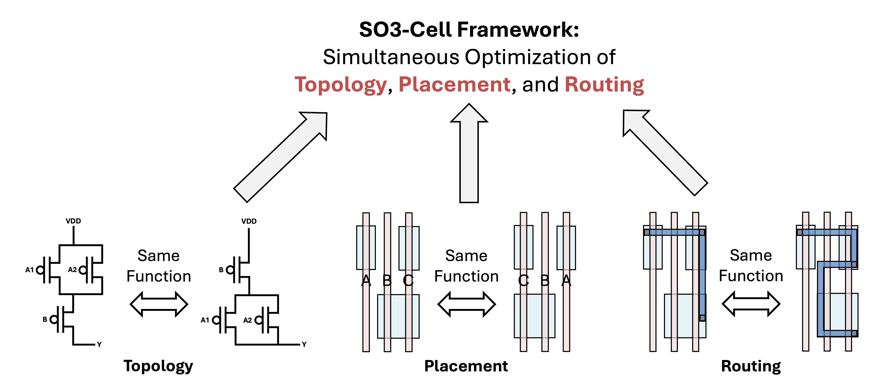

# SO3-Cell: Standard Cell Layout Automation Framework for Simultaneous Optimization of Topology, Placement, and Routing
The **SO3 standard cell generation framework** is the first framework that simultaneously optimizes
schematic topology, transistor placement, and in-cell routing.

This repository provides not only the full source code for the SO3 framework, but also a complete
set of pre-generated library views and related enablement assets required for practical evaluation.

If you use SO3 in any published work, we would greatly appreciate it if you could cite this paper [\[1\]](https://vlsicad.ucsd.edu/Publications/Conferences/418/c418.pdf).

We also emphasize that none of the data included here should be interpreted as benchmarking, and
no value judgments are made regarding the relative merits of commercial EDA tools.



The repository structure is as follows:

*   **`./Framework`:** This directory holds the core source code of the **SO3 Framework**, which is responsible for the automated generation of standard cell layouts. This directory consists of the following subdirectories:
    *   **CellGen:** This directory contains the code for generating GDS and LEF files of standard cells.
    *   **PostCellGen:** This directory contains the code for performing LVS/PEX and cell characterization (e.g., .lib file generation) based on the generated standard cell GDS files.
    *   **BlockDesign:** This directory includes scripts for evaluating the generated standard cells.
*   **`./Enablement`:** This directory provides a complete enablement kit, containing both the inputs for the framework and its pre-generated outputs.
    *   **Circuit Netlists (`./Enablement/cdl`):** The SPICE netlists that describe the circuits to be generated.
    *   **Timing Libraries (`./Enablement/lib`):** These are timing libraries used for static timing analysis. The files in this directory are pre-generated Liberty files, and these files can also be generated directly by using the **PostCellGen** directory.
    *   **Physical Libraries (`./Enablement/lef`):** These are LEF files that capture the physical abstracts of the cells for placement and routing. You can create LEF files using *Cadence Abstract* from GDS files.
    *   **Layout Data (`./Enablement/gds`):** These are the final GDSII stream files containing the full mask layout data. GDS files can be generated through the **CellGen** directory.
    *   **Database Files (`./Enablement/db`):** These are Synopsys-compatible database (.db) files for synthesis and P&R tools. They can be generated by converting Liberty files using *Synopsys Library Compiler*.

## Prerequisites

To set up and run this project, you will need the following dependencies installed on your system.

### System Dependencies

*   **Conda** (Miniconda or Anaconda) — recommended for environment management
*   **Python** 3.10 (managed via conda)
*   **Gurobi** 13.x with a valid license

### Gurobi License

This project uses **Gurobi** as its MILP solver. A valid license is required.

Students and faculty can obtain a **free, full-featured academic license** at:

*   [Gurobi Academic Program & Licenses](https://www.gurobi.com/academia/academic-program-and-licenses/)

After downloading the license file (`gurobi.lic`), place it in your home directory (`~/gurobi.lic`).

---

## Environment Setup

### 1. Create and activate a conda environment

```bash
conda create -n so3 python=3.10 -y
conda activate so3
```

### 2. Install Gurobi

```bash
# Install gurobipy (Python API + bundled solver)
pip install gurobipy

# Activate your Gurobi license (run once; requires ~/gurobi.lic to be present)
python -c "import gurobipy; gurobipy.Model()"
```

### 3. Install KLayout (Python API)

KLayout is used to generate GDS files. Install it as a Python package:

```bash
pip install klayout
```

Since the `klayout` Python package does not install a standalone CLI binary, create a
small shim script so `run_cell.sh` can invoke it by name:

```bash
KLAYOUT_BIN="$(python -c 'import sys; print(sys.prefix)')/bin/klayout"

cat > "$KLAYOUT_BIN" << 'EOF'
#!/usr/bin/env python3
"""Minimal klayout -b -r <script> shim for the SO3-Cell pipeline."""
import sys, runpy

def main():
    args, script, i = sys.argv[1:], None, 0
    while i < len(args):
        if args[i] == '-r' and i + 1 < len(args):
            script = args[i + 1]; i += 2
        else:
            i += 1
    if script is None:
        print("klayout shim: no -r argument", file=sys.stderr); sys.exit(1)
    runpy.run_path(script, run_name="__main__")

if __name__ == "__main__":
    main()
EOF

chmod +x "$KLAYOUT_BIN"
echo "Shim written to $KLAYOUT_BIN"
```

### 4. Set tool paths for the run script

`run_cell.sh` reads the `PYTHON` and `KLAYOUT` environment variables.
Set them to point to your conda environment before running:

```bash
export PYTHON=$(conda run -n so3 python -c "import sys; print(sys.executable)")
export KLAYOUT="$(dirname $PYTHON)/klayout"
```

Or, if the `so3` environment is already active:

```bash
export PYTHON=$(which python)
export KLAYOUT="$(dirname $PYTHON)/klayout"
```

## Running the Framework

### Standard Cell Generation
Follow these steps to generate the standard cell layouts.

First, activate the environment and change to the `Framework/CellGen` directory:

```bash
conda activate so3
export PYTHON=$(which python)
export KLAYOUT="$(dirname $PYTHON)/klayout"
cd Framework/CellGen
```

Next, run the `run_cell.sh` script:

```bash
./run_cell.sh --help

# Generate all cells from a CDL file under Enablement/cdl
./run_cell.sh --cdl-name SO3_L1

# Single-height (default) — specific cells
./run_cell.sh --cdl-name SO3_L1 --cells "NAND2_X1 INV_X1"

# Double-height, N-first (NMOS row at bottom, PMOS row on top)
./run_cell.sh --cdl-name SO3_L3 --cells "FA_X1_DH" --arch DH

# Double-height, P-first (PMOS row at bottom, NMOS row on top)
./run_cell.sh --cdl-name SO3_L3 --cells "FA_X1_DH" --arch DH --mh-order P_FIRST

# Use topology-optimization-free ILP (faster, looser constraints)
./run_cell.sh --cdl-name SO3_L1 --cells "INV_X1" --ilp-script src/ILP_notopo.py
./run_cell.sh --cdl-name SO3_L3 --cells "FA_X1_DH" --arch DH --ilp-script src/ILP_notopo.py
```

`run_cell.sh` wraps `bin/run_cell.py` (unified dispatcher `src/ILP_SO3_flex.py`), sets `PYTHONPATH` to include `Framework/CellGen/src`, and organizes outputs:
- `results/gds/` : GDS files emitted by KLayout (`.gds`). Default destination; override with `GDS_OUT`.
- `results/ilp/<cell>/<cell>` : ILP textual result per cell (solver summary, placement, routing info).
- `logs/gurobi/<cell>/gurobi.log` : Gurobi solver log per cell.
- `logs/models/<cell>/<cell>.lp|.mps|.prm` : ILP model snapshots (`.lp` human-readable, `.mps` exact) and parameter file (`.prm`) for reproducibility.

#### ILP script variants

| Script | Description |
|---|---|
| `src/ILP_SO3_flex.py` | Default — full SO3 with topology optimization (SH and DH via embedded blobs) |
| `src/ILP_notopo.py` | Dispatcher for topology-free variants; auto-selects SH or DH from `--arch` / `--mh-order` |
| `src/ILP_SH_notopo.py` | Single-height ILP without topology optimization constraints |
| `src/ILP_DH_notopo.py` | Double-height ILP without topology optimization constraints |

Pass any of these via `--ilp-script` to override the default.

### Standard Cell Verification and Characterization
In this part, LVS/PEX and cell characterization are performed for the generated standard cells.
All scripts used in this stage are derived from PROBE3.0 [\[2\]](https://vlsicad.ucsd.edu/Publications/Journals/j143.pdf).

First, change your current directory to the `Framework/PostCellGen` directory:

```bash
cd Framework/PostCellGen
```

Then, run the following command:

```bash
./run_all.sh
```

`run_all.sh` automatically calls `run.sh` with the appropriate library name.
`run.sh` performs LVS/PEX and cell characterization using the specified CDL and GDS files.
If you wish to use different CDL or GDS files, please modify the *CDL_FILE* and *GDS_FILE* paths inside the script accordingly.

Please note that running this step requires licenses for *Cadence Pegasus, Cadence Quantus, and Cadence Liberate*.

### Block Design Evaluation
To perform block-level evaluation, follow the steps below.

Please change your directory to the `Framework/BlockDesign/{LIB_NAME}` directory. (LIB_NAME can be one of SO3_L1, SO3_L2, SO3_L3, etc.)

```bash
cd Framework/BlockDesign/{LIB_NAME}
```

Then, run the following command:

```bash
./run_multi_area.sh
```

Please note that running this step requires license for *Synopsys Fusion Compiler*.

# Reference
\[1\] C.-K. Cheng, A. B. Kahng, B. Kang, S. Kang, J. Lee, and B. Lin, “SO3-Cell: Standard Cell Layout Automation Framework for Simultaneous Optimization of Topology, Placement, and Routing,” in Proceedings of International Conference on Computer-Aided Design (ICCAD) (2025). [(link)](https://vlsicad.ucsd.edu/Publications/Conferences/418/c418.pdf)
 
\[2\] S. Choi, J. Jung, A. B. Kahng, M. Kim, C. Park, B. Pramanik, and D. Yoon. “PROBE3. 0: a systematic framework for design-technology pathfinding with improved design enablement.” IEEE Transactions on Computer-Aided Design of Integrated Circuits and Systems (TCAD) (2023). [(link)](https://vlsicad.ucsd.edu/Publications/Journals/j143.pdf)
